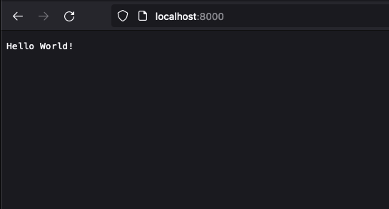

# Java HttpServer minimal

## Install

```shell script
$ brew install openjdk
$ brew install gradle
$ mkdir java-minimal
$ cd java-minimal
$ gradle init
```

Choose like below:
```
Select type of project to generate:
  1: basic
  2: application
  3: library
  4: Gradle plugin
Enter selection (default: basic) [1..4] 2

Select implementation language:
  1: C++
  2: Groovy
  3: Java
  4: Kotlin
  5: Scala
  6: Swift
Enter selection (default: Java) [1..6] 3

Split functionality across multiple subprojects?:
  1: no - only one application project
  2: yes - application and library projects
Enter selection (default: no - only one application project) [1..2] 1

Select build script DSL:
  1: Groovy
  2: Kotlin
Enter selection (default: Groovy) [1..2] 1

Generate build using new APIs and behavior (some features may change in the next minor release)? (default: no
Select test framework:
  1: JUnit 4
  2: TestNG
  3: Spock
  4: JUnit Jupiter
Enter selection (default: JUnit Jupiter) [1..4] 4

Project name (default: java-minimal): 
Source package (default: java.minimal): com.taptorestart.minimal
```

## Copy codes to App.java

```java
import com.sun.net.httpserver.HttpExchange;
import com.sun.net.httpserver.HttpHandler;
import com.sun.net.httpserver.HttpServer;

import java.io.IOException;
import java.io.OutputStream;
import java.net.InetSocketAddress;

public class App {
    public static void main(String[] args) {
        int PORT = 8000;
        try {
            InetSocketAddress address = new InetSocketAddress(PORT);
            HttpServer httpServer = HttpServer.create(address, 0);

            HttpHandler handler = new HttpHandler() {
                @Override
                public void handle(HttpExchange exchange) throws IOException {
                    String content = "Hello World!";
                    exchange.sendResponseHeaders(200, content.getBytes().length);
                    OutputStream outputStream = exchange.getResponseBody();
                    outputStream.write(content.getBytes());
                    outputStream.flush();
                    outputStream.close();
                }
            };

            httpServer.createContext("/", handler);
            httpServer.start();
        } catch (IOException e) {
            e.printStackTrace();
        }
    }
}
```

## Run
```shell script
$ ./gradlew run
```

## Screenshots

